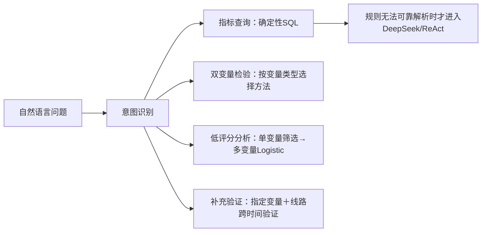

# Olist 业务数据分析助手

面向 Olist 电商履约与评分分析的自然语言指标查询、双变量检验和低评分关联因素分析工具。

基于已治理的三张分析宽表（Mart），由语义字典统一指标口径。常见指标查询和统计分析优先走确定性程序；只有规则无法可靠解析的问题才交给 DeepSeek/ReAct，从而兼顾可复现性与自然语言灵活性。每次查询保留来源 SQL，结果可对账。

## 当前版本状态

- 页面版本：`v1.1.0`
- 数据源：演示样本（截取数据）/ 完整业务数据库（MySQL）
- 自动化分析范围：指标查询、双变量统计检验、低评分关联因素分析、指定变量补充验证
- 自动测试：`133 passed, 1 skipped`
- 确定性核心评测：`117/117`
- 完整数据库 M 评测：41题×3轮，完成率与正确工具路径率均为`99.19%`



## 环境要求
- [uv](https://docs.astral.sh/uv/)（Python 项目管理）
- Python（由 uv 自动管理）

## 快速开始

Windows 本地使用：首次双击 `安装环境.bat`，之后双击 `启动Agent.bat`。
浏览器打开 `http://localhost:8501`，默认数据源为从三张完整分析宽表截取的演示样本。

```powershell
# 1. 初始化依赖（自动建 .venv）
uv sync

# 2. 运行单元与集成测试
uv run pytest tests/ -v

# 3. 运行 117 项确定性核心评测（演示样本，不调用 API）
uv run python tests/run_eval.py

# 4. DeepSeek 重复稳定性评测（41 个自然语言问题，每题重复 3 次）
uv run python tests/run_model_eval.py --repeat 3

# 使用完整业务数据库执行同一套评测
uv run python tests/run_model_eval.py --source mysql --repeat 3

# 5. 命令行交互（未配置 key 时使用内置示例响应检查流程）
uv run python run.py "请对低评分进行归因分析"

# 6. 启动网页界面（Streamlit Demo，⚠ 非最终 UI）
uv run streamlit run ui/app.py   # 浏览器打开 http://localhost:8501

# 7. 正式 UI（FastAPI + Vue3，企业级设计体系）
uv run uvicorn server.main:app --port 8000   # 后端 + 前端（生产单端口）
# 前端开发模式：cd web && npm install && npm run dev（proxy /api → :8000）
# 前端构建：cd web && npm run build（产物由后端自动托管）
```

DeepSeek重复评测会在每题结束后即时写入 `artifacts/evaluations/`。单题失败会记录意图、完成状态、工具路径和错误类型，并继续执行后续题目，不会终止整批评测。

## 接入 DeepSeek API

```powershell
# 推荐：复制示例配置并在本机填写，不要提交 .env
Copy-Item .env.example .env

# 在 .env 中填写
DEEPSEEK_API_KEY=sk-xxxx
DEEPSEEK_BASE_URL=https://api.deepseek.com
DEEPSEEK_MODEL=deepseek-chat
```

配置后通过 OpenAI 兼容接口调用 `deepseek-chat`。未配置密钥时，确定性指标查询与统计分析仍可运行；只有规则无法可靠解析的开放式问题不能调用大模型。DeepSeek API密钥由本机`.env`读取；数据库密码可来自`.env`或当前页面会话，`.env`已被Git忽略。

## 项目结构

```text
olist-qa-agent/
├─ pyproject.toml            # uv 配置
├─ run.py                    # 命令行交互入口
├─ data/
│  └─ sample/                # 三张 Mart 截取样本（本地文件，不提交）
├─ artifacts/                # 程序生成的评测结果与运行日志
│  ├─ evaluations/
│  └─ runtime_logs/
├─ semantics/
│  └─ metrics_dict.yaml      # 语义字典（唯一真相源，锁死口径）
├─ config/
│  └─ recommendation_rules.yml # 历史规则文件；当前分析流程不调用
├─ agent_core/
│  ├─ semantic.py            # 加载语义字典
│  ├─ data_provider.py       # 数据访问抽象（演示样本/完整MySQL数据库）
│  ├─ statistical_analysis.py# 统计入口（兼容现有调用）
│  ├─ bivariate_analysis.py  # 任意两个受控业务变量的规划与检验
│  ├─ query_analysis.py      # 常见指标/分组/排名的确定性取数
│  ├─ low_score_attribution.py # 低评分单变量筛选 + 共线性处理 + 多变量Logistic
│  ├─ deep_validation.py     # 指定变量补充验证 + 线路跨时间验证
│  ├─ tools.py               # 工具层：query_mart / top_n 等
│  ├─ intent.py              # 意图识别骨架
│  ├─ llm.py                 # 大模型客户端（DeepSeek / 测试替身）
│  └─ loop.py                # 自建 ReAct 循环
├─ docs/
│  ├─ design/                # 架构方案、框架评估与变更设计
│  └─ guides/                # 部署、协作与故障分析
├─ scripts/                  # 启动辅助脚本
├─ ui/                       # Streamlit 页面
└─ tests/
   ├─ eval_questions.yml     # 117 项确定性核心评测
   ├─ model_eval_questions.yml # 41 个真实表达问题
   ├─ manual_acceptance_questions.md # 完整数据库页面验收清单
   ├─ run_model_eval.py      # DeepSeek重复稳定性与延迟评测
   ├─ TEST_LOG.md            # 测试记录台账
   └─ test_m1.py             # 对账 + 端到端测试
```

## 设计要点

- **语义字典锁口径**：指标/维度必须来自 `metrics_dict.yaml`，模型只能"选"不能"编"
- **结构化 SQL**：`query_mart` 用模板生成 SQL，杜绝自由 join 与语法错误
- **可对账**：每次查询附来源 SQL，自动测试对演示样本执行“工具结果 vs 直接 SQL 重算”一致性校验
- **两种数据源**：演示样本用于功能检查与回归测试；只读 MySQL 完整业务数据库用于全量分析
- **三张 Mart 分工**：订单表、订单-卖家表和商品项表分别保持自身粒度；双变量分析只在存在共同受控粒度时执行，避免一对多连接制造重复样本
- **通用双变量统计路由**：不再把评价固定为结果变量；可检验金额×运费、时长×线路、跨州×时长、品类×支付方式等组合，并按变量类型固定选择卡方、Fisher、趋势检验、Mann–Whitney U、Spearman 或 Kruskal–Wallis
- **常见取数不依赖API**：明确的指标、分组和排名问题由本地规则映射到语义字典并直接查询；只有无法可靠解析的问题才回退DeepSeek
- **分析目标固定**：当前自动化关联因素分析只支持“是否低评分（review_score≤3）”；其他结果变量可先进行双变量检验或指标查询
- **两阶段统计流程**：先进行单变量检验，仅保留FDR校正后p<0.05且效应量95%CI排除无效值的变量；随后处理共线性并运行采用HC3稳健标准误的多变量Logistic模型
- **固定控制与结果输出**：订单级和订单-卖家级分别使用预设控制变量；只有控制其他因素后仍满足FDR显著性与置信区间标准的变量才展示分布和对象明细
- **负载受控**：分类变量先在数据库端聚合，连续变量每次只读取目标与一个特征；两个调整模型按Mart粒度串行读取必要字段，不把三张全量Mart同时载入内存
- **指定变量补充验证**：明确写出“深度验证/调整后/控制混杂”可验证指定变量；高风险线路另外使用较晚时期订单进行跨时间验证
- **不自动生成策略**：关联因素分析和补充验证只报告统计关联、置信区间与具体分布，不生成责任方、治理动作、监控指标或A/B方案
- **商品项显著性**：品类和商品按去重订单构造“是否包含该对象×是否低评分”的2×2检验，并用FDR-BH控制多重比较；样本不足时明确不下结论
- **模型稳定性单独衡量**：确定性测试与 DeepSeek 重复评测分开，后者报告完成率、正确工具路径率、重复一致率和 P50/P95 延迟

## 接入完整业务数据库

项目支持切换到完整 MySQL 业务数据库（`MySQLProvider`，pymysql 只读 + 白名单 + 限行）。演示样本用于快速回归，全量业务结论使用完整数据库：

```bash
# 1. 在 .env 填入数据库连接信息
DB_HOST=你的主机
DB_PORT=3306
DB_USER=你的账号
DB_PASSWORD=你的密码
DB_NAME=你的库名
DB_ITEM_TABLE=商品项分析宽表的实际表名

# 2. 使用完整数据库运行关联因素分析（--source mysql）
uv run python run.py --source mysql "对低评分进行归因"
```

当前读取层已适配三张分析宽表，并通过只读派生字段补齐月份、延迟分档和线路，不会修改数据库对象。

## 最新完整数据库评测

运行命令：

```powershell
.venv\Scripts\python.exe tests\run_model_eval.py --source mysql --repeat 3
```

注意：`--source mysql`的DeepSeek评测会向外部API发送模型作答所需的SQL与查询结果，不会发送数据库密码；运行前应确认数据发送范围符合使用要求。

2026-08-17评测使用99,441条订单级记录、100,010条订单-卖家级记录和112,650条商品项级记录，共执行123次：

| 指标 | 结果 |
|---|---:|
| 意图识别准确率 | 100.00% |
| 回答完成率 | 99.19%（122/123） |
| 正确工具路径率 | 99.19%（122/123） |
| 重复路径一致率 | 80.49%（33/41题） |
| DeepSeek调用完成率 | 98.67%（74/75） |
| 响应时间P50 / P95 | 5.449秒 / 88.302秒 |

唯一失败为M-16第3轮：数据库查询成功，DeepSeek生成回答时发生`APITimeoutError`。同一问题使用网页实际采用的确定性取数路径复测成功，耗时0.585秒，因此该失败属于模型压力测试路径，而不是数据库查询失败。

- 原始记录：[`artifacts/evaluations/mysql_model_eval_20260817_full.json`](artifacts/evaluations/mysql_model_eval_20260817_full.json)
- 中文总结：[`artifacts/evaluations/mysql_model_eval_20260817_full_summary.md`](artifacts/evaluations/mysql_model_eval_20260817_full_summary.md)

## 已知限制与后续重点

- 当前自动化关联因素分析只支持“是否低评分（1–3分）”作为目标变量。
- Mart不含评价正文、商品破损、错发、客服沟通、承运商和天气等信息，仍存在残余混杂与原因缺口。
- 全量低评分关联因素分析单次约88秒；应优先考虑结果缓存、重复特征提取复用和模型矩阵缓存。
- 8/41题存在调用签名波动，主要是DeepSeek偶尔附加订单量、低评分数等非必要辅助指标；目标指标和分组维度仍正确。
- 统计显著只说明观察性关联，不代表因果；系统不自动生成责任归属或治理策略。

## 文档入口

- 文档索引：[`docs/README.md`](docs/README.md)
- 本地部署与数据源切换：[`docs/guides/本地部署与使用说明.md`](docs/guides/本地部署与使用说明.md)
- 手工验收问题：[`tests/manual_acceptance_questions.md`](tests/manual_acceptance_questions.md)
- 自动测试记录：[`tests/TEST_LOG.md`](tests/TEST_LOG.md)
- M评测范围与判定标准：[`tests/benchmark_questions.md`](tests/benchmark_questions.md)

## 路线图

- M1（L1 问数）：语义字典 + 工具层 + ReAct 循环 + 对账测试 ✅
- M2（L2 描述性归因）：候选因素扫描 + Lift/超额低评分 + P0/P1/P2 + route 线路深挖 ✅
- M3（统计验证）：低负载卡方/趋势/MWU/Spearman + FDR与效应量95%CI；低评分归因自动运行受控Logistic ✅
- M4（输出与评测）：调整后仍显著变量的分布/对象明细，策略输出关闭 + 117 项确定性核心评测 ✅
- 稳定性评测：41 个真实表达问题，可配置题号和重复次数并输出 JSON 报告 ✅
- 接入完整 MySQL 数据库：`MySQLProvider` 已实现；页面输入密码后读取三张全量分析宽表 ✅
