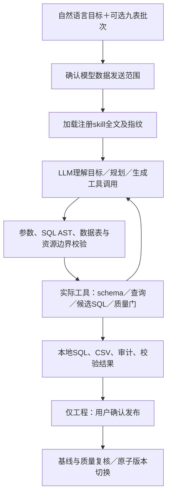

# LLM驱动数据工程与动态取数

更新日期：2026-10-04。部署目录仍为`olist_qa_agent/v2`，不是另建项目。原固定数据工程与A/B报表保留，AI入口为`/agent`。

## 1. 与固定程序的区别

固定程序按预写SQL依次执行；新入口把用户目标、skill和工具定义发送给LLM，由模型选择工具、生成SQL。工具结果回传给模型，模型继续检查、修正或澄清，直到形成实际执行结果。生成SQL、参考SQL和固定执行器有明确区别：reference_sql只读取字符串，必须在execute_sql中显式提交才执行。

此处采用模型function calling协议：模型请求调用，应用验证并执行，将工具输出再次交给模型。[OpenAI工具调用说明](https://developers.openai.com/api/docs/guides/function-calling)。DeepSeek使用兼容接口，沿用本地配置，而非要求切换成OpenAI模型。[DeepSeek接口说明](https://api-docs.deepseek.com/)。

## 2. 职责与工作栈

| 部分 | 作用 |
|---|---|
| DeepSeek兼容LLM＋HTTPX | 理解问题、规划步骤、写SQL、读取工具状态、继续修正；本机函数才是真正执行者 |
| skill加载器 | 从两个注册目录读取SKILL.md全文，记录SHA-256并放入任务上下文；模型不能指定任意文件路径 |
| Python工具循环 | 顺序执行工具、保存任务、暂停澄清及继续；24轮模型、80次工具、30分钟/次运行、累计token预算限制；连续三次工具失败停止 |
| SQLGlot 28.10.1 | 解析MySQL SQL AST，限制语句类型、数据库、表和危险函数；解析器不是业务正确性证明 |
| PyMySQL/MySQL8 | 真正执行SELECT、候选DDL和INSERT；查询只读事务，工程只能修改本任务Staging/Mart |
| FastAPI / SQLite | API入口与持久任务审计；模型消息内部保存，不从任务API返回内部上下文 |
| Vue3/TypeScript | 指令、批次、数据发送许可、轨迹、SQL、结果预览、下载与确认发布 |

沒有执行任意Python/shell的工具，没有凭据读取工具，没有模型可调用的publish工具。当前是本机单用户应用，不是共享多租户SQL平台；不能直接对公网暴露。

## 3. 动态取数

可问新组合，例如：“取2018年上半年RJ州已送达、实际延迟且运费率超过20%的订单，列订单号、主要品类、商品金额、运费和评分”。模型检查真实schema，再组合WHERE、JOIN、聚合、HAVING或窗口函数，并非匹配预写问题集。

预先确定的是权限、语义和粒度，不是条件：GMV为已送达商品金额且不含运费；客户按customer_unique_id；订单、订单—卖家、商品项有不同粒度，不能一对多连接重复计金额。歧义需ask_user，用户补充后继续同一工具循环。

run_query检查AST后，用READ ONLY事务执行EXPLAIN。预计中间结果超过1,000万行拒绝，SELECT服务端20秒限制，另有25秒KILL QUERY看门狗。LIMIT只限制最终输出，不能替代执行计划和超时。复杂查询仍可能被拒绝，不能保证任意JOIN都安全快速。

轻量CSV最多5,000行、UI预览50行；超限标记截断。另提供用户确认的完整导出：按当前发布版执行原始SQL，不使用工具自动添加的预览LIMIT，保留用户要求的LIMIT/筛选。使用一致性只读事务及流式游标写本地UTF-8 BOM CSV，精确保留DECIMAL和日期；完整行不进入LLM上下文。200万行、1GiB或5分钟任一上限触发失败，无可下载的部分文件；成功记录实际行数、版本校验和、文件SHA-256。导出与构建/维护共用互斥锁，服务中断后的未完成导出不可下载。CSV公式前缀加单引号保护，页面预览保留原值。

可配置只具SELECT权限的QUERY_DB_USER/QUERY_DB_PASSWORD。未配置时复用原数据库账户，因此是应用层AST＋只读事务防护，不等于已经部署最小权限账号。candidate查询使用工程连接但同样是只读事务。

## 4. 自主数据工程

先在数据工程页面上传或校验九张原始CSV，进入AI页选择待构建批次。模型先读校验摘要和schema，再调用prepare_workspace自动建立隔离数据库；CSV解析、Raw安全合并、生命周期与快照水位校验由已有工具完成。

模型可按需读参考SQL，再实际提交CREATE TABLE、INSERT…SELECT或DROP TABLE重建四张Staging、三张Mart。SQL必须限定在本任务候选库，Raw、正式库、其他库都不可由生成SQL改写；不能编造VALUES业务记录。允许自行改写建模表达式/索引，但需保持既有报表字段与主键粒度、InnoDB。

执行后检查兼容性及36项既有质量门，FAIL不允许进入待发布状态；WARNING保留缺失情况。模型完成并不自动发布。用户查看SQL与质量结果并确认，程序重新核验正式库业务表/版本标记的CHECKSUM、候选兼容性及质量门；基线变化拒绝发布，再用单条RENAME切换正式版本和备份。

当前只支持Olist九表合约；不是任意输入自动推断主键/更新语义的通用ETL。没有源更新时间、删除标记的数据，LLM仍不能可靠补出这些事实。固定36项检查和结构兼容也不能证明任意新字段定义正确；重大业务表达式改写仍应人工审核或增加对应断言。

AI发布的备份保留在_olist_backup_<任务ID>，原数据不删除。固定批次备份清理界面不主动清理AI任务的历史备份；当前没有把AI历史备份全部纳入自动保留管理。首次空库发布无完整前版，不应声称能恢复到一个不存在的业务版本。

已发布的AI工程任务提供“预览恢复上一版→确认”入口。预览核验当前任务确为最新发布版、前版完整且36项质量门通过，确认复核当前版和备份校验和及计划指纹，再原子恢复16张表与版本标记；后续版本、发布后直接修改、变化备份和过期计划均拒绝覆盖。若原子恢复后审计记录写入中断，恢复时比较当前库与保留库的校验和确认是否已提交，证据不足时保持待核验，不误报失败或再次覆盖。

## 5. 配置与外部数据边界

直接复用原.env，不覆盖：DEEPSEEK_API_KEY、DEEPSEEK_BASE_URL、DEEPSEEK_MODEL及DB_*。HTTP模型接口与本地/api接口是两回事：此次AI页实际发起外部模型请求，固定报表只调用本地服务/数据库。

每个AI任务需确认发送指令、skill、字段结构、校验摘要及状态；默认查询数据行不发给模型。额外许可后最多发每次50行预览。密码/API Key只由连接代码使用，不提供给模型；数据库字段注释及用户文字均视为不可信内容，不能提高工具权限。允许结果预览不等于允许任意文件上传。

默认不展示内部reasoning_content。执行轨迹显示的是工具名称、SQL和可验证状态，不是声称公开模型思维。任务审计保存在artifacts/agent，源批次仍在artifacts/engineering。

工程上下文会压缩成功SQL回执中已经重复的SQL正文，并将已用完参考替换为摘要与指纹；实际提交SQL仍保留在工具调用和本地原始审计中，失败详情及质量报告不删，参考仍可再次读取。这减少重复发送，不扩大权限或token预算。每次模型返回先记录usage，再检查累计预算；达到上限的那次响应也纳入费用审计。

## 6. 测试边界

tests/test_agent.py覆盖SQL动态形状、禁止跨库/写入/危险函数/多语句、候选Raw保护、skill白名单与指纹、发送许可、结果预览隔离、工具循环、澄清暂停、连续失败和进程恢复。

scripts/verify_agent_tools.py读取正式Olist执行新条件组合取数；取30笔真实订单的关联源记录构造CSV批次，以**脚本模型**走相同工具调用协议，在独立olist_agent_accept_*库建模、质量校验和确认发布。比较正式库全业务表校验和证明未覆盖正式库。脚本模型会提交一处新索引变体，但它不是DeepSeek规划稳定性测试。

真实模型验收需另外允许API请求，检查语义、SQL、CSV和质量结果；不能将mock/tool测试通过率当作LLM正确率。最新业务闭环复测U142项、实际DeepSeek M82项全部通过；三次完整99,441行导出逐字段对账通过，首次／增量／重叠版本的AI恢复另有真实HTTP验收。旧正式库城市转义差异已按源证据限定修复并保留完整前版，模型测试期间正式库不变。当前网页确认组件核验状态及新证据见 [业务闭环补齐与验收](业务闭环补齐与验收_20261004.md)，历史全量LLM时间扩展见 [上一轮完整验收](真实模型完整验收_20261004.md)。
