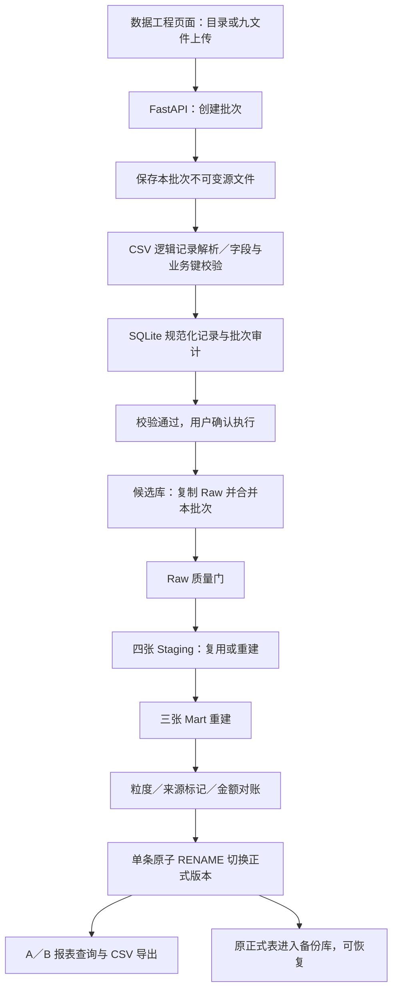

# Olist 数据工程与经营报表：架构、概念与实现说明

适用版本：在 `olist_qa_agent/v2` 中重建的数据工程版，2026-10-04新增LLM自主工程和动态取数。本文后续数据层及批次章节描述确定性基础引擎；新增执行循环、技能与权限详见 [AI Agent新增架构与操作](AI_Agent新增架构与操作.md)。不把旧版统计问答和归因模块算入当前能力。

最新实际验收：真实DeepSeek取数25题三轮75/75、工程及前置条件5/5、启用MySQL的U124/124通过；三张全量Mart内容对账通过，正式库未改。完整修正、旧基准源转义差异和能力边界见 [真实模型完整验收](真实模型完整验收_20261004.md)。

## 1. 系统解决什么问题

原项目已经完成一次性的九表导入、清洗、聚合和 BI 分析。新系统将这套过程变成可重复执行、有质量门、可审计和可恢复的数据更新流程。

核心业务任务是：收到新时间段的九张原始业务表后，在不重复计算历史数据、不部分覆盖正式库的前提下，扩展报表覆盖的时间范围。用户不再手工逐份执行 SQL、核对所有输出和重新导出报表数据。

系统有数据工程、AI数据助手、A · 经营总览、B · 增长来源四个页面。AI页支持自然语言动态取数与候选库SQL建模，不自行提出运营策略。

## 2. Agent、skill、工具和工作流分别是什么

| 概念 | 含义 | 本项目的实际情况 |
|---|---|---|
| Agent | 接收目标、依据状态选择动作、调用工具并检查结果的任务执行系统 | AI页具有LLM工具调用循环；固定数据工程按钮仍运行确定性工作流。两种模式不要混为一谈 |
| 大语言模型（LLM） | 理解自然语言并生成文本或工具调用计划 | AI页通过DeepSeek兼容接口调用本地配置的模型，需API Key；固定流程和报表不调用模型 |
| 工具（tool） | 接收明确参数、执行某项操作、返回结构化结果的能力 | CSV 校验、Raw 合并、SQL 构建、质量检查、发布、回滚、报表查询和导出，由 Python 函数及 HTTP 接口提供 |
| skill | 一组可复用的任务指引、约束、操作步骤和参考资料；不等同于函数、模型或算法 | 运行时加载注册的data-retrieval/olist-engineering SKILL.md全文、保存指纹并加入模型上下文；不是安装在Codex中的全局skill |
| 工作流（workflow） | 有固定顺序、分支和失败处理的任务过程 | 校验 → 等待确认 → 候选合并 → 质量门 → 建模 → 对账 → 原子发布，是本系统的核心 |
| 技术栈（tech stack） | 支撑应用的语言、框架、数据库和工具组合 | Python、FastAPI、MySQL、SQLite、Vue、TypeScript、ECharts 等 |
| 任务状态与审计 | 保存执行进度、输入、错误、结果和版本，便于继续查看或排查 | 批次 SQLite 和文件目录保存这些信息；不是自然语言对话记忆 |
| 幂等性 | 对同一批数据重复执行，不增加重复业务记录、不改变已有正确结果 | 有键表按业务键合并，无键表按完整记录及重复次数匹配；无变化且构建版本一致时不重新发布 |
| CDC | 从源业务系统持续获取新增、更新、删除事件 | 当前是 CSV 批次接入，不是 CDC。CSV 缺少更新时间和删除事件，不能自动恢复它没有提供的信息 |

例如，`profile()` 是 CSV 校验工具，`build()` 是可信Raw合并/固定构建工具，`raw_checks()` 是质量规则集合；它们不是三个独立智能体。新增执行循环在agent_core/runtime.py，不依赖RAG向量库或多Agent协作。

模型可以自由组合查询条件、生成受限候选SQL并依据错误修正；状态转换、增量政策、金额对账和正式发布仍由程序约束。不是仅让模型生成固定流程参数，也不是开放shell和任意正式库DML。

## 3. 技术栈与职责

| 层级 | 实现 | 作用 |
|---|---|---|
| 前端 | Vue 3、TypeScript、Vite | 路由、导入参数、上传、任务进度、质量结果、备份管理和报表页面 |
| 图表 | ECharts 5 | 指标月度趋势、地区／品类／卖家贡献等可视化 |
| API | Python、FastAPI、Pydantic | 请求参数校验、统一错误响应、任务入口、报表与导出接口 |
| 本机服务 | Uvicorn，默认 `127.0.0.1:8000` | 提供 API 与构建好的前端静态资源 |
| 数据库访问 | PyMySQL，参数化 SQL | 分批 INSERT、数据库聚合、SQL 建模、质量门和版本切换 |
| 业务数据 | MySQL 8、InnoDB | 保存九张 Raw、四张 Staging、三张 Mart 及版本标记 |
| 本地任务数据 | Python 标准库 SQLite | 保存批次审计和磁盘上的规范化源记录，不是另一个经营数据库 |
| 配置 | `.env`、python-dotenv | 连接地址、账户、数据库名和源目录；凭据不写进文档或接口响应 |
| 测试 | pytest、FastAPI TestClient、httpx、隔离 MySQL 库 | 单元／契约回归及实际 HTTP 全流程验收 |

运行依赖中没有全量 pandas 分析或并行 Logistic 训练。数据处理采用文件流、磁盘索引、分批写入和 SQL 聚合，避免把百万行宽表一次载入 Python 内存。

## 4. 总体架构与数据流

只有质量门通过才发布。解析错误或 FAIL 留在批次记录中；正式库保持原版本。WARNING 记录可解释的数据缺失，不等同于全部数据没有异常。

### 4.1 输入与 CSV 解析

`engineering/contracts.py` 定义九张表的标准文件名、列名、业务键和可空字段。表头可以改变列顺序，但不能缺列、多列或重复列名。

`engineering/source.py` 使用标准 CSV 解析器按**逻辑记录**读取。评价文本中的逗号、引号和嵌入换行不会当作新记录；不通过文本行数判断数据行数。检查 UTF-8 编码、32 位 ID、州缩写、邮编、日期、评分 1–5、金额非负及经纬度范围等。

每个文件保存 SHA-256 指纹、逻辑行数、重复数、冲突数和无效记录位置。有键数据同一业务键若出现不同内容，校验失败；相同内容重复记录只保留一条用于有键合并。无键表保留每种完整记录的源重复次数。

规范化记录及其键存入本批次 `records.sqlite3`，而非全部保存在 Python 列表中。API 上传单文件上限为 2 GiB；九张文件全部提供，没有增量的表可以只有表头。

### 4.2 新时间段为什么不能把九张表都按年份裁切

订单具有购买时间，商品项、支付和评价能按订单 ID 关联到该时间范围。但客户、商品、卖家、品类翻译和地理数据没有相同的业务时间字段。

因此，“接入 2018 年”意味着提供 2018 年订单相关事实及所需维度；可以重复提供完整维度快照。缺少被新订单引用的客户、商品或卖家会被关联质量门拦截。不能只根据 CSV 的行位置或文件名称判断年份。

### 4.3 两种合并模式与旧快照保护

**仅追加（默认）**：接收新业务键及已有相同记录；已有有键记录的有效内容发生改变则失败，不覆盖历史。订单增量中的空履约时间不清除已有非空时间。

**快照更新**：允许更新已有有键记录，但必须提供可信、带时区、非未来的上游快照时间，例如 `2026-10-03T10:00:00+08:00`。它是数据提取／快照的时间，不是订单购买时间。执行前必须晚于已发布的快照水位；旧快照与同时间更新拒绝执行。

旧库没有水位时，首次显式快照更新建立基线；程序无法证明用户填的时间确实来自上游。所以这是一项输入契约和防误操作机制，不是对 CSV 真实新旧的自动鉴定。没有可靠快照时间就采用仅追加，不猜测。

缺行不删除历史记录；缺失更新时间或删除标记不能靠模型补出来。当前没有删除事件导入入口，需要更正／删除历史业务记录时必须制定独立的受控修复流程。

订单状态采用明确的转换规则：created → approved → processing／invoiced → shipped → delivered；processing 和 invoiced 视为同级。允许向前跳级，允许未终结订单进入 canceled／unavailable；delivered、canceled、unavailable 为终结状态，默认仅允许保持原状态。任何模式下都保护订单客户与购买时间，不能用新快照绕过身份冲突或状态回退检查。

### 4.4 按什么粒度合并

| Raw 表 | 合并依据 |
|---|---|
| raw_orders | order_id |
| raw_customers | customer_id |
| raw_order_items | order_id + order_item_id |
| raw_order_payments | order_id + payment_sequential |
| raw_products | product_id |
| raw_sellers | seller_id |
| raw_category_translation | product_category_name |
| raw_order_reviews、raw_geolocation | 完整记录内容及出现次数：相同内容保留历史与本批次次数的较大值 |

最后两张表没有稳定唯一键，无法区分“重复快照”与“新增且内容完全相同的事件”。采用上述保守规则可防导入膨胀，但不是事件级去重的完美替代。

### 4.5 Raw 如何成为三张 Mart

Raw 保持原始业务粒度，不直接将所有一对多表连接成宽表。

四张 Staging 分别承担：

1. `stg_geolocation_zip`：把同邮编多条位置记录聚合为邮编级坐标。
2. `stg_order_payments`：把多支付记录聚合成订单金额、主要方式及支付结构。
3. `stg_order_reviews`：按既定排序选择订单最终评价，同时保留评价记录数量等信息。
4. `stg_order_items_summary`：汇总订单商品数量、金额、运费、商品属性和主要品类。

三张 Mart 对应三个分析粒度：

- `mart_order_delivery`：一行一个订单，用于订单级经营指标、评价与最终履约指标。
- `mart_order_seller_delivery`：一行一个订单—卖家组合，用于卖家贡献和交接分析；订单评价不是卖家独立评价。
- `mart_order_item_business`：一行一个订单商品项，用于品类／卖家的真实商品金额贡献。第三张表以现行 SQL 名称为准，不是旧口头名称 `mart_order_item_delivery`。

订单支付、评价、商品和邮编先归到合适粒度，再构建 Mart，避免一张订单乘以多支付、多评价、多商品产生金额膨胀。

## 5. 质量门、发布与恢复

当前完整构建执行 36 项检查：Raw 阶段 13 项，模型阶段 23 项。包括引用完整性、已送达订单至少有一个商品项、评分／金额范围、Staging 聚合粒度、Mart 行数保全、最终评价选择、来源与业务标记，以及商品／运费／支付的 DECIMAL 金额对账。

缺少支付、非标准时间顺序、缺少品类翻译和地理信息以 WARNING 保留；其他关键失败阻止发布。特别是“已送达但没有商品项”不能只作为空值告警，否则订单数正常而 GMV 缺失、客单价失真。

构建使用 `_olist_work_<批次ID>` 候选库。单条 MySQL 8 原子 `RENAME TABLE` 切换 16 张业务表和 `_eng_version`，旧版表进入 `_olist_backup_<批次ID>`。不会先更新 Raw 再让旧 Mart 继续对外暴露。

发布版本记录批次 ID、构建签名、输入指纹、合并模式和快照水位。报表在数据库读取事务中查询一个一致版本。

恢复仅针对当前发布的批次：旧备份必须仍完整，恢复后当前表放入 `_olist_retired_<批次ID>`；版本标记与快照水位一起恢复。无变化批次没有新版本，不能回滚它。首次空库构建没有完整上一版可恢复。

## 6. 如何控制计算与存储负担

输入文件指纹和构建签名一致时，复用该 Raw 的已有数据，不重新生成大表内容指纹进行重复匹配。Raw 仍复制到候选库，不通过共享正式表绕过隔离。

合并没有新增／更新且构建签名一致时，完成质量检查后标记“未变化”，不重建 Mart、不发布新版本、不新增备份。更改 SQL 或规则后签名不同，必须重新构建，不能把旧的错误结果当作可复用缓存。

有数据变化时，可按依赖复用未受影响的 Staging：邮编依赖地理表，支付依赖支付表，评价依赖评价表，商品汇总依赖商品项／商品／品类翻译。**发生业务数据变化时三张 Mart 仍全量重建**，以处理维度更新影响历史订单；当前不是订单级增量刷新系统。

备份管理提供“预览 → 确认删除”。默认保留最近创建的三个已发布／已回滚批次的备份，并额外保护当前版本的上一版；仅处理当前批次审计库可证明归属的备份。确认时复核计划指纹、精确库名和表范围，防止计划过期或误删正式库。

备份删除永久不可恢复；清理后对应更早版本不可回滚。系统不会自动清空既有备份，不清理失败候选、恢复库、源文件或旧版代码备份。这些仍需要单独保留政策，当前没有宣称全部存储自动封顶。

## 7. 功能入口与实现位置

| 能力 | 主要位置／接口 |
|---|---|
| 目录校验 | `POST /api/imports/local` → `Jobs.prepare()` |
| 九文件上传 | 创建上传批次 → PUT 每个文件 → POST validate |
| 执行更新 | `POST /api/imports/{id}/execute` → `Jobs.execute()` → `build()` |
| 状态与结果 | GET imports、GET 单批次；前端周期轮询 |
| 质量门 | `engineering/quality.py` |
| 版本恢复 | `POST /api/imports/{id}/rollback` |
| 备份预览／清理 | `/api/maintenance/backups` 与其 prune 接口 |
| A／B 查询 | `/api/reports/overview`、`/api/reports/growth` |
| Mart 导出 | `/api/exports/{table}`，仅允许三张 Mart |
| AI查询完整导出 | POST `/api/agent/tasks/{id}/results/{result}/export-full`；同一任务查询、人工确认、当前发布版、流式本地CSV |
| AI版恢复 | GET任务`rollback-plan` → POST任务`rollback`，需确认与有效计划token |
| 旧城市转义修复 | `/api/maintenance/source-text/preview` → `repair`，仅源文件可证明的指定文本差异 |

任务状态为：等待／上传 → 校验 → 待构建 → 构建 → 已发布或未变化。无效输入、构建失败和服务中断分别记录，不伪装成成功；重启时核验 MySQL 版本标记，区分已提交发布和未完成构建。

当前使用单服务后台线程，不是持久化队列调度器。进程中断后未完成任务需要重新提交；不会自动从某张表的半截 INSERT 继续。

AI取数的5,000行仅是轻量结果上限。完整导出在人工确认后按原始SQL重新读取当前发布版，以一致性只读事务、流式游标写CSV；保留原SQL的用户LIMIT和筛选，记录实际版本、行数、SHA-256。完整数据不发给模型、不全量载入pandas。200万行/1GiB/5分钟为保护上限，超限或中断时不提供部分结果。原预览可能是较早版本，不能认为完整导出必然与它同一时点。

旧卖家城市修复不是LLM猜测或通用upsert：要求源CSV键、邮编、州完全一致，且城市差异严格吻合反斜杠+r被旧导入器变为回车。预览显示影响行数与源指纹；确认后复制完整三层到候选，只修正三处表中的城市字段，通过36项质量门和基线复查后发布。原文件与已有快照水位不改，前版完整保留。

前端将操作错误与连接错误分开：成功轮询会清除连接错误，刷新按钮也重新获取批次；后台任务真正失败的原因仍保留，不因恢复连接而消失。

## 8. 固定报表的指标口径

A 页以已送达订单商品金额、订单数、去重客户数和商品客单价为核心，显示月度趋势及延迟／低评分分母样本。商品金额不含运费；客户按 `customer_unique_id` 去重，不能按每单一个 `customer_id` 当独立客户。

B 页按相同月份窗口比较两个年份，区分订单量、客户量和单均金额对增长的贡献，并从客户州、品类、卖家显示 Top 10 金额、集中度和 HHI。品类和卖家贡献来自商品项 Mart，不把整单金额全部归给订单主要品类。

月度筛选按购买时间归属，默认结束月来自有已送达业务数据的月份，避免仅有取消／不可用订单的尾月制造 GMV 曲线骤降。用户指定不同范围仍应检查边界月份是否完整。

报表展示相关业务描述，不进行自动归因，不输出因果结论或策略建议。旧版统计问答与三目标归因不在当前运行路径中。

## 9. 如何验证“能完成任务”

U 类：pytest 回归覆盖解析、数据合约、政策、MySQL 合并、质量门、接口拦截和安全清理。

M分为两类，不沿用旧归因Agent的测试集：**M-F固定任务验收**用原始九表构造2018年前及2018年后的事实批次，通过独立服务的实际HTTP接口完成首次建库、上传扩展、重复导入、版本化更新、失败隔离、报表／导出对账和恢复，零外部API；**M-LLM真实模型验收**调用配置的DeepSeek，验证动态SQL、分母与粒度、Raw回探、澄清、安全拒绝及实际候选建模，需明确数据发送许可。后者不能由脚本模型工具链测试代替，运行方法见 [MU测试指南](MU测试指南.md)。

测试创建隔离数据库 `olist_contract_*`、`olist_retention_*`、`olist_accept_*` 等，正式库只读取并比较测试前后行数与金额。全量验收不仅看程序没有报错，还断言扩展后 99,441 笔订单、99,224 条原始评价、1,000,163 条地理记录和 112,650 条商品项，以及各层金额相符。

U 和 M 应串行执行；构建、恢复、清理共享全局互斥锁，不能一边执行 M 构建，一边要求 U 的清理操作成功。

复测命令和实际结果请分别查阅 `任务验收与复测指南.md`、`验收结果.md`；不能把一次全绿解释为任意输入、并发或故障场景都已经证明没有问题。

## 10. 使用边界与学习重点

当前适合本机单用户、Olist 合约内的批次工程与固定经营报表。不要直接暴露到公网：没有多用户鉴权、权限分级、租户隔离和企业级部署配置。本地文件路径接口和建库账户的权限也需要在共享部署前收紧。

CSV 没有提供的更新时间、删除事件与稳定无键记录 ID，仍是源数据约束。数据引擎不是用来推断这些事实的；业务终结状态的人工修正也需要独立流程。

源记录快照、测试库、失败候选和恢复库会继续占空间。备份清理有安全确认，不代表所有工件自动清理。应根据可恢复期限和磁盘容量制定保留计划。

学习这个项目最重要的不是“用了多少 Agent 名词”，而是：明确输入契约与更新语义 → 按正确粒度建模 → 用可验证不变量阻止错误 → 隔离构建并安全发布 → 让报表口径与数据版本一致。业务分析中的指标定义，最终变成数据工程中的合约、质量门和可复用报表。
