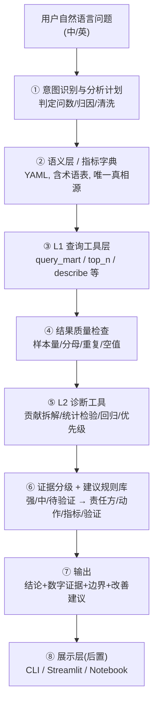

# 智能问数 Agent 方案设计

> 项目：Olist 电商经营与履约体验分析 · 自然语言问数 Agent
> 基础：前三阶段数据工程 +《Olist电商经营分析项目立项书》+《低评分归因与改善建议Agent搭建思路》
> 数据库：MySQL 8
> 版本：v2.6（字段名沿用朋友命名；新增 4.10 展示层 Demo UI；M1-M4 已实现）

---

## 0. 背景与定位

在已完成的数据工程（mart 层口径锁死、质量门全通过）基础上，构建用自然语言查询业务数据并**完成归因诊断与改善建议**的分析 Agent。

**能力定位（两层）**：

| 层级 | 核心能力 | 示例 | 难度 |
|---|---|---|---|
| L1 响应式执行 | 自然语言转结构化查询：指标、分组、排名、趋势 | "延迟订单的低评分率是多少？" | ★★ |
| L2 理解式洞察 | 自动形成分析计划：多维下钻、统计验证、治理优先级、改善建议 | "请对低评分归因并提出改善建议。" | ★★★ |

**联网调研共识**：先语义层和数据底座，再用 agent 做 NL 交互与执行编排；本项目前置已具备。

---

## 1. 设计原则（含业界最佳实践）

1. **语义层/指标层先行**：口径锁死，LLM 只能"选"指标，不能"编"。
2. **宽表优先、禁止自由 join**：按问题域路由到对应 mart 表；第一版禁止模型自由连接两表。
3. **SQL 结构化生成**：主查询结构化参数 + 模板 SQL，杜绝语法错误与 join 风险。
4. **反射校验 + 结果对账**：`check` 节点 + 输出附 SQL，延续"可对账"要求。
5. **统计显著 ≠ 业务重要**：同时报告样本量、效应大小与问题规模，不只给 p 值。
6. **观察数据只谈关联、禁因果**：不表述"导致/造成"，只能"显著相关/控制变量后仍关联"。
7. **建议由规则库映射**：建议含责任方/动作/指标/验证方式，不由 LLM 自由发挥。
8. **只读 + 行数上限 + 小样本过滤 + 人审**。
9. **核心逻辑与技术栈解耦**、**展示层后置**。

---

## 2. 总体架构



---

## 3. 数据底座：4 张 mart 表

以立项书建议的 4 张表为目标查询面。**当前已落地 2 张**（样例数据模拟中），其余在数据工程补充：

| 问题域 | mart 表 | 粒度 | 当前状态 | 职责 |
|---|---|---|---|---|
| 履约/体验 | `mart_order_delivery` | 一单一行 | ✅ 样例数据 | **订单级归因主表**：履约/订单结构/客户时间/评分 |
| 履约/体验 | `mart_order_seller_delivery` | 一单-卖家一行 | ✅ 样例数据 | **卖家/线路归因表**：卖家/跨州/距离/线路 |
| 经营表现 | `mart_order_summary` | 一单一行 | 待建 | GMV、客单价、趋势、贡献度 |
| 履约/经营 | `mart_order_item_detail` | 一商品项一行 | 待建 | 商品、品类、卖家明细 |

**字段名标准（沿用朋友命名）**：`is_late_delivery`（延迟）、`late_days`（延迟天数）、`delivery_variance_days`（日期差）、`has_review_record`（有评价）、`is_low_score`（评分≤3）、`is_strict_negative_score`（评分≤2）、`is_delivery_analysis_eligible`（履约样本）、`primary_category_name`（主要品类）、`primary_payment_type`（主要支付方式）、`order_month`、`route`（州际线路）、`is_multi_seller_order`。

**两表使用原则**：
- 订单结构与整体体验 → `mart_order_delivery`
- 卖家、跨州、距离、州际线路 → `mart_order_seller_delivery`
- 第一版**不允许模型自由连接两表**，分别出证据、结果层汇总
- 多卖家订单（`is_multi_seller_order=1`）：按 `order_id` 去重计低评分，**禁止 `COUNT(*)` 重复计算评价**

**核心口径**：

```text
分析样本：has_review_record = 1（低评分分母）
低评分：is_low_score = 1，即 review_score <= 3
严格负面敏感性：is_strict_negative_score = 1，即 review_score <= 2
履约分析样本：is_delivery_analysis_eligible = 1
卖家/线路归因：默认 is_multi_seller_order = 0
```

---

## 4. 核心模块设计

### 4.1 语义层 / 指标字典（唯一真相源，YAML）

字段名沿用朋友命名，见 `semantics/metrics_dict.yaml`。模型只能"选"预置指标与维度：

```yaml
metrics:
  low_score_rate:       {expr: "AVG(is_low_score)",            desc: "低评分率(评分<=3)"}
  strict_negative_rate: {expr: "AVG(is_strict_negative_score)", desc: "严格负面率(评分<=2)"}
  late_rate:            {expr: "AVG(is_late_delivery)",        desc: "延迟率"}
  on_time_rate:         {expr: "1 - AVG(is_late_delivery)",    desc: "按时交付率"}
  avg_late_days:        {expr: "AVG(late_days)",               desc: "平均延迟天数"}
dimensions:
  - customer_state / primary_category_name / primary_payment_type
  - delay_bucket / is_late_delivery / order_month / route

guards:
  low_score_definition: "review_score <= 3"
  reviewed_only: true                  # 低评分分母 = 有评价订单
  min_group_sample: 100                # 分组最小样本量，过滤小样本
  multi_seller_rule: "卖家/线路分析默认 is_multi_seller_order=0；多卖家按 order_id 去重，禁止 COUNT(*) 重复计算评价"
  text_boundary: "mart 表不含评价正文，禁止臆测破损/错发/客服/退款等文本原因"
  forbid_join: true / read_only: true / max_rows: 10000
```

### 4.2 意图识别 + 问题域路由

- **意图分类**：`指标查询` / `维度对比` / `生成报告` / `口径询问` / `数据清洗` / `归因诊断`
- **参数抽取**：指标、维度、筛选、时间范围、Top-N、排序、任务类型
- **问题域路由**：按关键词映射到 mart 表工具
  - 经营 → `mart_order_summary`；履约 → `mart_delivery_analysis`；体验 → `mart_order_delivery`；卖家/线路 → `mart_order_seller_delivery`
- **归因意图**：`归因` / `为什么` / `改善` / `建议` / `优先治理` → 进入 L2 归因诊断流程（4.8）
- **兜底**：置信度低时先调用 `list_metrics` 向用户确认，不猜测

### 4.3 工具层（L1 查询工具）

| 工具 | 作用 |
|---|---|
| `list_metrics / list_dimensions` | 返回可用指标/维度 |
| `query_mart(table, metrics, dimensions, filters, order_by, limit)` | **主工具**，结构化参数 → 模板 SQL |
| `top_n(table, metric, dimension, n)` | 排名 Top-N |
| `describe_table(table)` | schema + 样例 |
| `explore(table, sql)` | 只读探查（白名单 + limit，禁 join） |

主查询 SQL 由模板生成，杜绝自由 join；每次返回附 SQL 供对账。数据清洗工具见 4.6。

### 4.4 Agent 编排（ReAct + 反思）

- 主编排 **ReAct + 反思**，不引入多 Agent 团队；正确率低再演进（独立检查节点/复盘-检查两段式）
- 反思：工具报错/空结果回喂重试，最多 3 轮；空结果提示"筛选过严或口径不同"
- **System Prompt 核心约束**：
  1. 低评分固定 `review_score<=3`，分母必须有评价订单
  2. 先报告总体基准，再比较分组；每项结论含样本量、低评分率、效应大小
  3. 订单分析用 `mart_order_delivery`；卖家/线路用 `mart_order_seller_delivery`
  4. 卖家/线路默认 `is_multi_seller_order=0`，禁止重复计算评价
  5. 统计显著 ≠ 业务重要；综合规模、风险增幅、可干预性、置信区间
  6. 观察性数据只谈关联，禁止"导致/造成"
  7. 无评价正文，不得臆测破损、错发、客服、退款等文本原因
  8. 建议必须对应已验证证据，含责任方/动作/指标/验证方式
  9. 只允许 SELECT，只访问白名单 mart 表；输出附数据来源与口径
  10. 数据不足时说明缺口，不用常识补造结论
- 动态 system prompt：注入当前计划、已执行步骤、遇到的困难

### 4.5 统计检验与归因工具（扩展）

由基础统计工具扩展为完整 L2 归因工具集：

| 工具 | 作用 |
|---|---|
| `build_baseline` | 建立总体低评分基准（样本量/低评分数/低评分率） |
| `screen_factors` | 批量扫描候选因素：各组样本量、率、Lift、问题规模 |
| `excess_low_score` | 超额低评分：`样本量 × max(组内率 - 基准率, 0)` |
| `categorical_test` | 二分类×二分类：卡方/Fisher，报告 RR/OR + 95%CI |
| `distribution_test` | 连续×二组：Mann-Whitney U + 效应量 |
| `correlation_test` | 连续/有序：Spearman 相关 + 置信度 |
| `trend_test` | 有序分组趋势：二项 Logistic 趋势检验 |
| `logistic_model` | 多变量：调整 OR + HC3 稳健标准误 + 95%CI |
| `rank_priorities` | 综合规模×风险×可干预性，输出 P0/P1/P2 |
| `recommend_actions` | 从建议规则库映射动作 |

**贡献拆解指标**：样本量、低评分率、基准率、百分点差、`Lift = 组内率/基准率`、`超额低评分数`。仅看率会突出小样本、仅看数量会突出大流量，**必须同时观察风险率、问题规模与超额低评分**。

**统计方法匹配表**：

| 业务问题 | 数据类型 | 方法 |
|---|---|---|
| 延迟/非延迟与低评分 | 二分类×二分类 | 卡方/Fisher + RR/OR + CI |
| 低评分与配送时长 | 连续偏态×二组 | Mann-Whitney U + 效应量 |
| 重量/距离/运费率与评分 | 连续/有序 | Spearman 相关 |
| 延迟等级与低评分趋势 | 有序×二分类 | 二项 Logistic 趋势检验 |
| 控制变量后延迟是否重要 | 多变量×二分类 | Logistic 回归，HC3 稳健 SE，调整 OR |
| 多组同时比较 | 多重检验 | Holm / Benjamini-Hochberg 校正 |

**模型约束**：延迟相关高相关变量（`is_late_delivery`/`late_days`/`delivery_variance_days`）不共入一模型，拆"是否延迟/延迟程度"两模型；订单级与单卖家订单级各建一模型，避免跨粒度。

### 4.6 SQL 数据清洗模式

（保持 v2.4 内容：双模式、5 个清洗工具、双账号权限、预览对账、人工确认、回滚，只作用 staging 不碰 mart。）

### 4.7 增强能力：结论置信度标注 + 上下文持久化

**置信度标注**：归因/洞察结论附"证据强度 + 是否经统计检验 + 来源 SQL + 置信度"。

**证据分级（三级）**：

| 等级 | 判定 | 表述 |
|---|---|---|
| 强证据 | 样本充分、校正后显著、效应有业务意义、敏感性口径方向一致 | "当前数据中最稳定的风险因素" |
| 中等证据 | 描述差异与单变量检验稳定，调整模型减弱/缺关键控制变量 | "值得优先下钻或试点验证" |
| 待验证线索 | 高比例但样本小、区间宽、多重校正后不显著 | "暂不能列为治理原因" |

**上下文持久化**：持久化已用指标/维度/口径偏好/历史结论，支持多轮追问。

**回答结构模板（固定 5 段）**：

```markdown
## 一、总体判断      —— 低评分基准、最重要 2-3 个风险因素及边界
## 二、归因证据      —— 优先级/风险因素/样本量/率/基准率/Lift/超额低评分/调整OR/证据等级
## 三、改善建议      —— 优先级/责任方/动作/监控指标/验证方式
## 四、不能下结论的部分 —— 数据缺口、观察性限制、小样本/未显著因素
## 五、数据来源      —— 表、筛选条件、口径、统计方法
```

### 4.8 L2 归因诊断（新增）

**定位**：L1 之上完成"多维下钻 → 异常定位 → 统计验证 → 治理优先级 → 改善建议"闭环。

**归因口径**：基于观察数据的风险因素诊断与贡献拆解，**非因果归因**——只能"显著相关/控制现有变量后关联仍存在"，不能"必然导致"。

**执行流程（顺序工作流，第一版单 Agent + 确定性工具）**：

```
1. understand_question  识别指标/时间/范围/任务类型
2. plan_analysis        选择订单模型或卖家/线路模型
3. query_baseline       建立低评分基准
4. scan_dimensions      扫描候选因素（订单级/卖家线路级）
5. validate_results     检查样本量、分母、重复、异常值
6. run_tests            按变量类型选统计检验
7. fit_models           订单级 + 单卖家订单级 Logistic（含敏感性）
8. rank_drivers         计算 Lift、超额低评分数、证据等级
9. map_actions          调用建议规则库
10. compose_answer      生成业务结论、建议与限制
11. audit_answer        检查数字可追溯、禁止因果越界
```

**候选因素**：
- 订单级：是否延迟、延迟天数/等级、审批/交运/运输/总履约时长、客户州、月份、品类、运费率、金额、商品数、卖家数、重量、支付方式/分期
- 卖家/线路级：卖家是否晚交运、是否跨州、距离、卖家州/客户州/线路、卖家订单规模

**边界**：当前 mart 表无评价正文，只覆盖结构化风险因素；完整文本归因需第三数据面 `mart_review_text`（预留，M4 后评估）。

### 4.9 建议规则库（新增）

- 配置文件：`config/recommendation_rules.yml`
- 建议**不由 LLM 自由发挥**，由规则库把已验证因素映射为 `责任方/动作/监控指标/验证方式`，模型只组织语言
- 规则示例：延迟1-3天→客服/物流主动通知+更新ETA；延迟4天+→人工介入+补偿；高规模跨州线路→线路SLA+P90预警；卖家晚交运→临期提醒+分层整改；多商品/多卖家→分包进度展示；品类偏高→下钻SKU+评价文本
- 输出约束：每条建议含"动作-责任方-指标-验证方式"，禁止泛化措辞（如"加强物流管理"）

### 4.10 展示层 Demo UI（⚠ 非最终界面，从简）

> **定位：Demo 原型界面，仅用于开发测试与演示，不是最终 UI。** 核心逻辑零改动，UI 只是一层薄壳。正式界面在后续独立设计。

- **技术**：Streamlit 单文件（`ui/app.py`），几十行，不引入新架构
- **功能**（从简）：
  - 聊天输入框 + 消息流（支持 DeepSeek 真调 / 无 key 提示）
  - 归因类问题 → 结构化渲染：基准指标、P0/P1/P2 优先级表格、route 深挖、统计验证摘要、建议卡片
  - 问数类问题 → 答案 + 来源 SQL
  - 侧边栏：运行 26 题标准评测按钮、数据源说明（样例/MySQL）
- **明确标注**：界面顶部常驻"⚠ Demo 原型界面，非最终 UI"
- **正式 UI 方向（后续，非本次）**：FastAPI 后端 + 前端框架；Streamlit 保留为内部调试工具

---

## 5. 技术选型

**当前（已用）**：uv + Python + SQLite 样例 + openai(DeepSeek `deepseek-v4-flash`) + pyyaml + pytest + python-dotenv。

**后续（M2/M3 接入）**：`scipy`、`statsmodels`（HC3 稳健标准误）、`SQLAlchemy`+`PyMySQL`（只读连 MySQL）、`pydantic`（工具入参出参约束）；FastAPI/Streamlit 为展示层可选。

核心逻辑框架无关：**自建轻量 ReAct + YAML 语义字典**（推荐）；DB-GPT / WrenAI 作为可选重型方案。

---

## 6. 里程碑（对齐 M1-M4）

| 阶段 | 内容 | 状态 |
|---|---|---|
| **M1（L1 问数）** | 语义字典 + 工具层 + ReAct 循环 + 对账测试 | ✅ **已完成**（样例数据，真实 LLM 联调通过） |
| **M2（L2 描述性归因）** | 候选因素扫描、Lift/超额低评分、规模×风险排序、P0/P1/P2、小样本过滤 + **route 线路深挖**（Top/集中度/×延迟交叉） | ✅ **已实现**（`attribution.py` + MySQLProvider 接入准备，测试 21 通过） |
| **M3（统计验证）** | 卡方/Fisher/MWU/Spearman/趋势、订单级+单卖家 Logistic(HC3)、多重校正、证据分级 | ✅ **已实现**（`statistics.py`，自动并入归因 verification 块，测试 32 通过） |
| **M4（建议与评测）** | 建议规则库（并入归因）、26 题标准问题评测（确定性 26/26）、安全/因果越界/可执行性检查 | ✅ **已实现**（`recommendation.py` + `tests/run_eval.py`，测试 44 通过） |

贯穿项：4.7 置信度标注 + 上下文持久化在 M2/M3 中落地。

---

## 7. 风险与对策

| 风险 | 对策 |
|---|---|
| 模型自由 SQL 出错/幻觉 | 结构化参数 + 模板 SQL，杜绝自由 join |
| 口径被改错 | 指标锁在语义字典，只能"选"不能"编" |
| 跨表 join 粒度放大 | 默认禁 join，卖家/线路走独立表 |
| 多卖家评价重复计算 | 默认 `is_multi_seller_order=0`，按 order_id 去重 |
| 小样本组排名虚高 | `min_group_sample=100` 过滤 + 同时看率/规模/超额 |
| 因果越界 | 约束"只谈关联"，审计节点禁止"导致/造成" |
| 臆测文本原因 | `text_boundary`：无评价正文不得臆测 |
| 建议泛化 | 建议规则库强制"责任方/动作/指标/验证" |
| 清洗误操作 | 双账号 + 白名单 + 预览确认 + 回滚（4.6） |
| 数字对不上账 | 输出附关键 SQL 与口径，可对账 |

---

## 8. 目录结构

```text
olist-qa-agent/
├─ pyproject.toml / run.py / README.md / .env(.example)
├─ data/sample/                    # 三张 Mart 截取演示样本
├─ artifacts/                      # 评测结果与运行日志
├─ config/
│  └─ recommendation_rules.yml   # 历史规则；当前流程不调用
├─ semantics/
│  └─ metrics_dict.yaml          # 语义字典（唯一真相源）
├─ scripts/                       # 启动辅助脚本
├─ agent_core/
│  ├─ semantic.py / data_provider.py / llm.py / intent.py / loop.py
│  ├─ tools.py / query_analysis.py
│  ├─ bivariate_analysis.py / statistical_analysis.py
│  └─ low_score_attribution.py / deep_validation.py
├─ docs/
│  ├─ design/                    # 方案与变更设计
│  └─ guides/                    # 部署、协作与故障分析
├─ ui/
│  └─ app.py                     # Streamlit 页面
└─ tests/
   ├─ eval_questions.yml / model_eval_questions.yml
   ├─ run_eval.py / run_model_eval.py
   └─ test_*.py / TEST_LOG.md
```

---

## 9. 验收标准

| 维度 | 验收要求 |
|---|---|
| 指标正确性 | 低评分率、延迟率、样本量与人工 SQL 完全一致 |
| 粒度安全 | 多卖家订单不重复计算评价；两表不发生失控连接 |
| 方法匹配 | 按变量类型自动选择检验并报告效应量 |
| 结论可追溯 | 每个数字可溯源到表、筛选、SQL 或统计工具 |
| 边界控制 | 不把相关写成因果；不臆测缺失评价文本的原因 |
| 建议质量 | 每条建议含责任方、动作、指标和验证方式 |
| 稳定性 | 相同问题重复询问，核心数字与结论一致 |
| 安全性 | 只读账号；禁 DML/DDL；限表、行数、执行时间 |

---

## 10. 下一步

1. 维持 M1 现状（已通过过渡测试）。
2. M2：L2 描述性归因（候选因素扫描、贡献拆解、排序）。
3. 接真实 MySQL（实现 `MySQLProvider`，按标准字段名对齐真实 mart 表）。
4. 更新 TEST_LOG 记录每次变更与测试。

---

## 11. 正式 UI（FastAPI + Vue3，企业级）

> 状态：首期已实现（核心两页）；替代 4.10 的 Streamlit Demo 作为企业正式界面。

### 11.1 技术栈
- 后端：`server/main.py`（FastAPI + uvicorn），把 agent_core 包装为 REST + SSE API，核心逻辑零改动
- 前端：`web/`（Vue3 + Vite + TS + Element Plus + ECharts + Pinia），按 Modern SaaS 设计体系
- 数据源：固定后端配置（默认 ProjectCsvProvider；`USE_MYSQL=1` 用 MySQLProvider）

### 11.2 API
- `POST /api/intent` / `query` / `statistical` / `attribution` / `deep-validation`（透传 agent dict）
- `GET /api/meta`（语义字典 + 数据源标签）；`POST /api/chat`（**SSE 流式**：intent→running→result/step→answer→done）
- 生产模式托管 `web/dist`（单端口 8000）

### 11.3 页面（首期）
- **总览看板** `/dashboard`：KPI 栏（低评分率/延迟率/样本/平均评分 + Sparkline）+ 延迟分档面积图 + 品类 Donut + 州条形图
- **智能对话** `/chat`：SSE 流式 + 结果卡片（归因→优先级表+OR 森林图+建议；统计→方法/p/效应量；查询→表格+SQL）

### 11.4 二期
设置页（数据源/评测）、登录权限与审计、报告导出（PDF/Excel）、DeepSeek 逐 token 流式、更多图表（漏斗/地图）。

---

## 12. 开发规范：确定性-LLM 分工原则（2026-08-17 确立）

> 背景：全量联调中发现确定性解析"部分识别当成功"的静默降级缺陷（维度丢失仍返回单值）。

**铁律**：
1. **能确定的用确定性快路径**（query/statistical/attribution 等专用模块，可对账、快、省 LLM 成本）
2. **不能确定的明确回退 LLM**（DeepSeek ReAct 兜底），**绝不静默降级**给"看似正确"的部分答案
3. 判定"确定性覆盖不了"的标准：解析不完整（维度暗示未识别 / 指标未识别 / 模块不支持）或执行失败
4. **持续补全别名库**（query_analysis.METRIC/DIMENSION_ALIASES），扩大确定性覆盖、减少 LLM 调用
5. 无 LLM key 时给出明确提示，不用 Mock 冒充真实结果

**已落地**：query incomplete 检测 + server 三处 ReAct 兜底（query/statistical/deep_validation）；详见 TEST_LOG §26。
