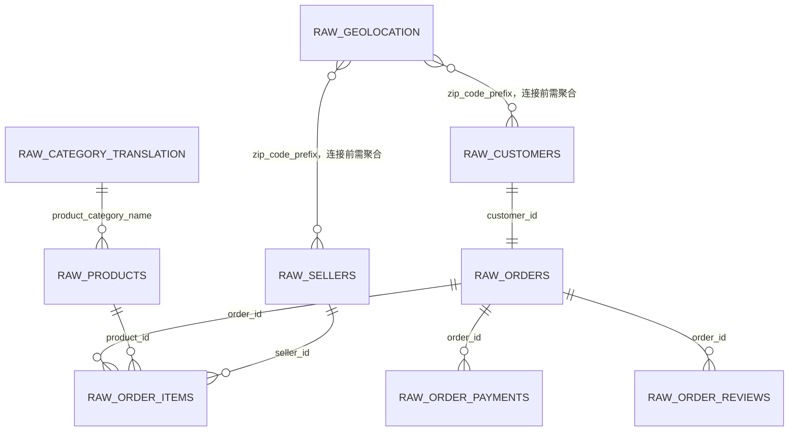
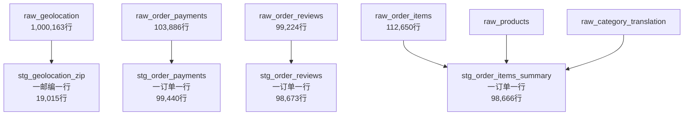
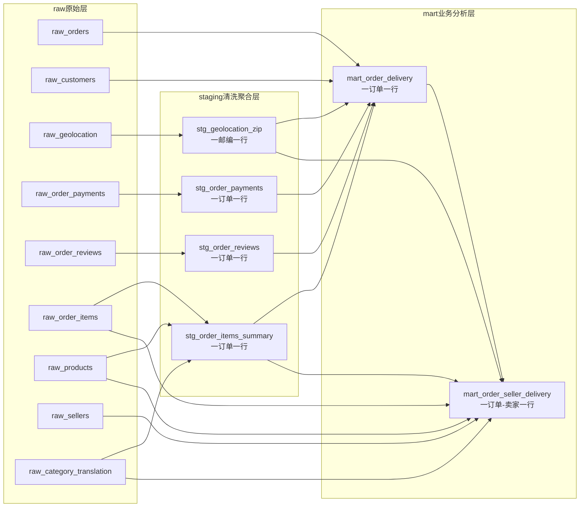
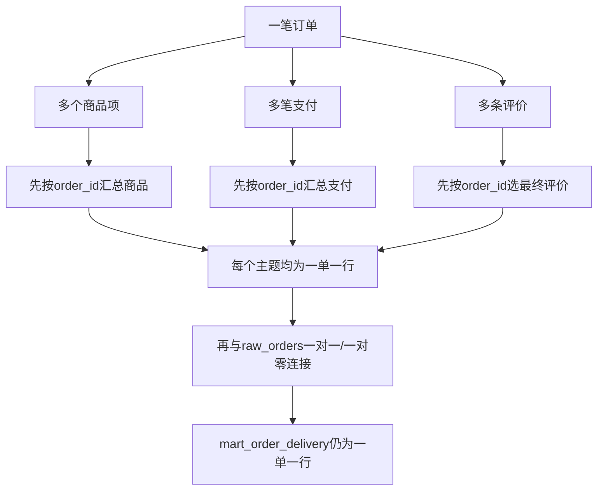

# Olist电商履约分析项目前三阶段数据工程总结报告

> 项目主题：通过改善订单履约表现，降低低评分率并提升用户满意度  
> 数据库：MySQL 8  
> 报告范围：原始层导入、staging清洗聚合层、mart业务分析层  
> 当前状态：前三阶段质量检查全部通过

## 一、报告摘要

本部分工作的目标不是直接回答“哪些卖家导致低评分”，而是先建立一套可信、可复现、可对账的分析数据基础，将9个粒度不同的CSV文件逐步转换成可以直接用于业务分析的订单级和订单—卖家级数据集。

整个过程解决了三个核心问题：

1. **可用性**：将外部CSV可靠地导入MySQL，正确处理路径、换行、引号、反斜杠、缺失值和数值精度。
2. **一致性**：将一单多商品、一单多支付、一单多评价和一邮编多坐标分别聚合，避免直接连接造成订单数和金额膨胀。
3. **业务可分析性**：围绕“配送延迟—客户评分”主线，构建订单履约宽表和订单—卖家履约表，统一延迟、低评分和分析样本口径。

截至本报告完成时，数据已经从原始文件转化为：

- 9张`raw_`原始表；
- 4张`stg_`清洗聚合表；
- 2张`mart_`业务分析表；
- 3套分层质量检查SQL；
- 全部关键行数、唯一性、关联完整性和金额对账检查均通过。

## 二、整个数据工程部分的目标

Olist数据分散在订单、商品、支付、评价、客户、卖家和地理位置等文件中。不同文件的业务粒度不同，不能直接全部连接。例如，一笔订单同时存在2个商品项、2笔支付和2条评价时，直接按`order_id`连接可能扩张为8行，导致商品金额、运费和订单数被重复计算。

因此，前三阶段的总体目标是：

> 在保留原始数据的前提下，先将每个主题整理到稳定、唯一的业务粒度，再围绕履约和评分问题构建分析宽表，并用自动化质量检查保证每一步没有丢失或重复数据。

最终需要支持的核心业务问题是：

> Olist应如何通过改善订单履约表现，降低低评分率并提升用户满意度？平台应优先治理哪些卖家、地区、线路和履约环节？

前三阶段只负责为这一问题提供可信的数据基础，不提前作业务结论。

## 三、总体数据处理流程


三个已完成阶段分别承担不同职责：

| 层级 | 核心职责 | 是否修改业务粒度 | 主要使用者 |
|---|---|---|---|
| raw层 | 完整接收CSV，尽可能保留源字段 | 否 | 数据接入、质量检查 |
| staging层 | 清洗、去重、聚合到稳定粒度 | 是 | 数据建模、主题数据复用 |
| mart层 | 围绕履约和评分组织分析字段 | 是 | SQL分析、Python、Excel、BI |

## 四、源数据表关系



需要特别注意：

- `customer_id`接近订单级客户标识，跨订单识别真实客户必须使用`customer_unique_id`。
- 订单商品、支付和评价表都可能一单多行。
- 地理位置表的邮编前缀不是唯一键。
- 一笔订单可能包含多个卖家，因此卖家分析不能只依赖订单级宽表。

## 五、阶段一：raw原始层导入与质量检查

### 5.1 阶段目标

阶段一负责把9个CSV可靠地装载到MySQL，并建立可重复执行的建库、建表、导入和质量检查流程。此阶段不进行业务汇总，重点是保证“数据库中的数据与CSV一致”。

### 5.2 原始表及规模

| raw表 | 业务粒度 | 导入行数 |
|---|---|---:|
| `raw_customers` | 一个订单级客户标识一行 | 99,441 |
| `raw_geolocation` | 一个邮编坐标记录一行 | 1,000,163 |
| `raw_order_items` | 一个订单商品项一行 | 112,650 |
| `raw_order_payments` | 一笔支付记录一行 | 103,886 |
| `raw_order_reviews` | 一条评价记录一行 | 99,224 |
| `raw_orders` | 一笔订单一行 | 99,441 |
| `raw_products` | 一种商品一行 | 32,951 |
| `raw_sellers` | 一个卖家一行 | 3,095 |
| `raw_category_translation` | 一个品类翻译一行 | 71 |

### 5.3 建表原则

- 编号字段使用`CHAR(32)`，避免将业务ID误识别为数值。
- 邮编使用`CHAR(5)`，保留`09790`等前导零。
- 金额使用`DECIMAL`，避免浮点误差。
- 日期时间使用`DATETIME`，空日期通过`NULLIF`导入为`NULL`。
- 评价文本使用`TEXT`并采用`utf8mb4`，保留葡萄牙语字符、换行和特殊符号。
- 评价表的`review_id`和`order_id`均非绝对唯一，因此增加`review_row_id`代理主键。
- raw层不强行设置表间外键约束，先完整接收数据，再通过质量SQL检查关联完整性。

### 5.4 阶段一质量门

`03_raw_data_quality_check.sql`完成了：

- CSV预期行数与数据库实际行数对比；
- 订单时间范围和状态分布检查；
- 关键字段缺失统计；
- 一单多商品、一单多支付和一单多评检查；
- 订单—客户、商品—订单、商品—卖家等关联完整性检查；
- 支付方式和评分取值范围检查；
- 地理位置邮编重复程度检查。

结果：所有行数检查均为`PASS`，关键表关系正常。

## 六、阶段二：staging清洗聚合层

### 6.1 阶段目标

staging层负责解决原始表的粒度冲突。每张表只处理一个数据主题，并将其聚合到后续分析可稳定连接的唯一粒度。



### 6.2 四张staging表

#### `stg_geolocation_zip`

粒度：一个邮编前缀一行。

处理方法：

- 同一邮编的经纬度取平均值；
- 城市和州取该邮编下出现频次最高的组合；
- 保留源记录数和城市—州组合数量，便于识别地理信息不一致。

#### `stg_order_payments`

粒度：一笔存在支付记录的订单一行。

处理方法：

- 汇总订单支付总金额；
- 统计支付记录数和支付方式数；
- 主要支付方式按该方式支付金额最高确定；
- 保留最大分期期数、是否多笔支付和是否多种支付方式。

该表为99,440行，而订单表为99,441行。原因是源数据中有一笔已送达订单没有任何支付记录：

```text
order_id = bfbd0f9bdef84302105ad712db648a6c
```

处理原则不是删除订单或将金额直接填0，而是在mart层通过左连接保留订单，并设置`has_payment_record = 0`。

#### `stg_order_reviews`

粒度：一笔有评价订单一行。

处理方法：

- 一单多评时，保留`review_answer_timestamp`最晚的一条，代表最终评价；
- 主低评分口径：`review_score <= 3`；
- 严格负面口径：`review_score <= 2`，用于敏感性分析；
- 标记是否存在评价文字并计算评价响应时长；
- 保留原订单的评价记录数，识别一单多评。

#### `stg_order_items_summary`

粒度：一笔存在商品明细的订单一行。

处理方法：

- 汇总商品金额、运费和含运费金额；
- 统计商品项数、不同商品数和不同卖家数；
- 汇总商品重量和体积；
- 主要品类按订单内商品金额最高确定；
- 计算运费率并保留商品属性缺失数量；
- 保存订单最早和最晚发货时限。

### 6.3 阶段二质量门

`05_staging_quality_check.sql`完成了：

- staging行数与raw连接键去重数对比；
- 主键唯一性检查；
- raw支付金额与staging支付金额对账；
- raw商品金额、运费与staging汇总金额对账；
- 评分范围与低评分标记检查；
- 商品数量、金额、运费率和品类合理性检查；
- 多支付、多评价和多卖家订单抽样检查。

结果：四张表行数、唯一性和金额对账全部`PASS`。

## 七、阶段三：mart业务分析层

### 7.1 阶段目标

mart层不再按源文件组织数据，而是围绕业务问题组织字段。它将订单、客户、支付、商品、评价、卖家和地理位置连接成可直接分析的数据集。

### 7.2 raw到mart的完整血缘关系



### 7.3 `mart_order_delivery`

粒度：一笔订单一行，共99,441行。

该表从`raw_orders`出发，因此所有订单都会保留。支付、商品、评价和地理信息均使用左连接；缺失主题记录时不删除订单，而是用存在性标记和`NULL`表达。

主要字段分为：

- 订单状态与五个关键时间点；
- 客户唯一编号、城市、州和坐标；
- 支付金额、方式和分期；
- 商品金额、运费、数量、品类、重量和体积；
- 最终评分、低评分标记和严格负面标记；
- 支付审批、交运、运输和总履约时长；
- 配送分析资格、延迟状态和日期差。

核心口径：

```text
配送分析有效样本：已送达，且实际送达、预计送达时间完整
配送日期差：实际送达日期 - 预计送达日期
延迟订单：配送日期差 > 0
低评分：review_score <= 3
严格负面：review_score <= 2
```

延迟按自然日判断，而不是直接比较完整时间戳。原因是预计送达字段通常记录为当天`00:00:00`；如果比较时间戳，预计日期当天白天送达也会被错误判为延迟。

### 7.4 `mart_order_seller_delivery`

粒度：一笔订单中的一个卖家一行，共100,010行。

该表用于卖家、地区和州际线路分析，包含：

- 客户与卖家的城市、州、邮编和坐标；
- 是否跨州及经纬度计算的近似运输距离；
- 卖家在该订单中的商品数、金额、运费、重量、体积和主要品类；
- 最早、最晚发货时限；
- 订单实际交运时间与发货时限的差值；
- 最终配送延迟、评分和低评分标记；
- 是否为多卖家订单。

数据局限：`order_delivered_carrier_date`是订单级时间，不是每个卖家的独立扫描时间。对于多卖家订单，将该时间用于卖家归因只能作为运营排查线索，不能证明某个卖家严格导致最终延迟。

### 7.5 阶段三质量门

`07_mart_quality_check.sql`完成了：

- 订单宽表是否保留全部99,441笔订单；
- 订单主键是否唯一；
- 订单—卖家组合是否与raw商品表一致；
- 支付、商品、运费在staging与mart之间是否对账；
- 卖家级金额是否与raw商品明细对账；
- 支付、商品、评价存在性标记是否正确；
- 履约资格、延迟和评分标记是否符合定义；
- 时间异常、地理坐标缺失和多卖家订单数量画像；
- 核心分析样本规模概览。

结果：关键验收项全部`PASS`。

## 八、逐层汇总为什么不会重复计算



该设计的关键不是“把所有字段放在一张表”，而是先控制每个输入表的粒度。只有商品、支付和评价都整理为一单一行后，才允许连接到订单表。

卖家分析则保留订单—卖家粒度，并只汇总该卖家对应的商品项金额，从而保证卖家级金额求和仍能与raw商品明细完全对账。

## 九、实施过程中遇到的问题与解决方法

| 问题 | 表现 | 根因 | 解决方法 | 形成的经验 |
|---|---|---|---|---|
| 中文路径无法导入 | `File not found`，但CSV实际存在 | Workbench/MySQL本地文件读取对中文路径兼容不稳定 | 将项目目录从`实习`改为`internship`，SQL统一使用纯英文绝对路径 | 数据项目路径优先使用英文、数字和下划线 |
| CSV换行格式不一致 | 多张表导入0行，评价与翻译表表现不同 | 7个文件使用LF，评价和翻译使用CRLF | 按文件分别设置`LINES TERMINATED BY '\n'`或`'\r\n'` | 不应假定同一数据集所有CSV物理格式相同 |
| 带引号表头导致少一行 | 多张表均比预期少1行 | 自定义`ESCAPED BY '"'`干扰带引号表头解析 | 去掉不必要的同字符转义设置，按MySQL引号规则解析 | 导入后必须以逻辑记录数而非肉眼判断验收 |
| 评价表仍少一行 | 第77917行日期截断、字段过多 | 评价正文以反斜杠结尾，MySQL默认把反斜杠当转义字符 | 评价表单独使用`ESCAPED BY ''`，保留标准CSV原文 | 文本字段必须考虑引号、反斜杠和嵌入换行 |
| 经纬度出现近200万条截断警告 | `Data truncated for geolocation_lat/lng` | `DECIMAL(11,8)`小于源数据最多20位小数 | 改为`DECIMAL(23,20)`并重新导入 | 建表精度需要通过全量画像确认 |
| 评价文本不能按物理行计数 | 文本行数高于逻辑评价数 | 评价正文中含有合法换行 | 使用真正的CSV解析规则；质量基准以逻辑记录为单位 | 外部CSV不能简单使用换行数作为记录数 |
| staging支付表少一单 | 99,440笔支付订单，对比99,441笔订单 | 源数据确有一笔已送达订单没有支付记录 | 从订单表出发左连接，保留订单并设置`has_payment_record = 0` | 缺失关联不应被自动删除或随意填0 |
| `TINYINT(1)`弃用警告 | MySQL警告1681 | 新版MySQL弃用整数显示宽度 | 改为`TINYINT`，仍使用0/1表达布尔值 | 显示宽度不是取值约束 |
| 卖家mart插入时断开 | 30.031秒后`Lost connection` | 命中Workbench默认30秒读取超时 | 将DBMS connection read timeout调整为600秒后重建 | 长查询需要区分客户端超时和服务器失败 |
| 一单多主题直接连接风险 | 可能造成金额和订单数成倍放大 | 商品、支付、评价均是一对多关系 | 分主题先聚合到唯一粒度，再连接订单 | 每次JOIN前必须明确左右表业务粒度 |
| 多卖家延迟归因限制 | 无法确认每个卖家的独立交运时间 | 数据只提供订单级交运时间 | 单独标记多卖家订单，并把卖家结果定位为排查线索 | 结论强度不能超过字段所能支持的范围 |

## 十、质量检查体系总结

项目没有依赖人工逐行检查，而是为每层设置自动化质量门：

| 质量维度 | 检查方式 | 失败处理 |
|---|---|---|
| 完整性 | 行数、关联缺失、时间缺失 | 阻止进入下一层或标记缺失 |
| 唯一性 | 主键与业务键去重数 | 重复时停止构建 |
| 合法性 | 评分范围、金额正负、运费率范围 | 输出异常数量和样本 |
| 一致性 | raw、staging、mart金额对账 | 差异不为0则停止分析 |
| 粒度 | 行数与去重业务键比较 | 防止多行连接放大 |
| 时效与范围 | 最早/最晚时间、状态分布 | 识别观察窗口和同步异常 |
| 可追溯性 | SQL文件编号、分层表名、字段口径 | 保证可复现和便于面试说明 |

质量检查采用`PASS / WARNING / FAIL`思路：

- 主键重复、金额不平、标记错误属于`FAIL`；
- 合理的业务缺失或少量地理缺失属于`WARNING`并保留标记；
- 已知的文本缺失只做描述，不作为失败条件。

## 十一、当前数据架构成果

```text
Brazilian E-Commerce Public Dataset/
├─ dataset/
│  └─ 9个原始CSV
├─ database/
│  ├─ 00_preflight_check.sql
│  ├─ 01_create_database_and_tables.sql
│  ├─ 02_load_raw_csv.sql
│  ├─ 02a_reload_order_reviews.sql
│  ├─ 03_raw_data_quality_check.sql
│  ├─ 04_create_staging_tables.sql
│  ├─ 05_staging_quality_check.sql
│  ├─ 06_create_mart_tables.sql
│  └─ 07_mart_quality_check.sql
└─ docs/
   └─ 前三阶段数据工程总结报告.md
```

前三阶段已经形成从外部文件到业务分析数据集的完整链路：

```text
CSV → MySQL raw层 → staging主题聚合 → mart业务宽表 → 自动化质量验收
```

## 十二、下一阶段衔接

下一阶段不再继续扩充数据层，而是使用现有mart表正式回答业务问题：

1. 计算有效配送订单、延迟率、低评分率等总体基准；
2. 比较提前、按期和延迟订单的评分表现；
3. 分析延迟1–3天、4–7天、8–14天和15天以上的低评分变化；
4. 拆解支付审批、卖家交运和物流运输时长；
5. 按客户州、卖家州、品类、卖家和州际线路定位问题；
6. 使用Python检验延迟与低评分关系是否显著；
7. 形成高优先级治理对象和可量化的运营建议。

前三阶段的价值在于：后续任何SQL、Python、Excel或BI结果都建立在一致的业务粒度和可复核的指标口径上，避免“图表能展示，但数字无法解释或对账”的问题。