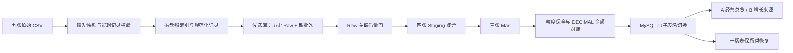

# 数据工程与固定经营报表架构

## 与原报告的关系

原报告记录 9 Raw → 4 Staging → 2 Mart。后续 `11_create_operating_item_mart.sql` 增加第三张商品项 Mart：`mart_order_item_business`。新版复用现行 SQL，补充批次、增量合并、质量门强制执行与版本发布，不改订单／卖家／商品项粒度。

订单金额从商品汇总进入订单 Mart；品类和卖家金额从商品项 Mart 计算。支付和评价先按订单汇总后关联，防止一对多联接重复计算。

## A 页

| 指标 | 分子／数值 | 分母／计数 |
|---|---|---|
| 商品金额 | 已送达订单 product_value 求和 | — |
| 已送达订单数 | delivered 的 order_id | 订单级唯一 |
| 已送达客户数 | delivered 的 customer_unique_id | 当前筛选窗口内去重 |
| 商品客单价 | 已送达商品金额 | 已送达订单数 |
| 延迟率 | 有效准时性样本中的延迟订单数 | 已送达且实际／预计日期完整 |
| 低评分率 | 有效评价中评分 ≤3 的已送达订单数 | 有 1–5 分评价的已送达订单 |

按购买月份归属历史最终状态；没有某月的样本时留空。默认趋势范围从 2017-01 到最新存在已送达订单的月份，避免把仅有取消订单的尾部月份解释成已送达经营下跌。

## B 页

同期窗口使用两年相同月份，例如 2017／2018 年 1–8 月；州筛选同步，趋势月份筛选不改变该窗口。年份和共同月份可调整，默认比较最新已送达年份与前一年。

商品金额 = 订单数 × 商品客单价；商品客单价 = 单均商品件数 × 件均价格。增长率为本期／上期 −1，上期为 0 时留空。金额 Top 10 在筛选窗口内重新排序；集中度计算使用全部对象，HHI 按 0–10,000 标尺展示。

客户州、品类、卖家金额分别与订单商品金额对账；品类／卖家订单数有交叉，不能相加得到平台订单数。人均订单数属于消费频次汇总，不能直接当作复购率。

## 实施边界

原始文件没有通用版本时间、稳定评价／地理记录键和删除事件。默认仅追加，拒绝已有有键记录变化；显式快照更新必须声明可信且更晚的带时区源快照时间，首次建立水位基线。完整记录多重集合匹配及生命周期状态保护仍是明确约定，不等于完整 CDC 语义。

相同源指纹且规则签名一致时复用 Raw；未受变更影响的 Staging 按依赖复用。合并无变化且规则未变时对账后沿用当前版本，不重建 Mart 或新增备份。业务数据变化时 Mart 仍全量重建，未宣称只处理变化订单。备份采用预览与精确目标确认清理，保留最近批次备份和当前上一版；失败候选与输入快照仍需单独保留政策。详见 [Agent详细说明](Agent详细说明.md)。
